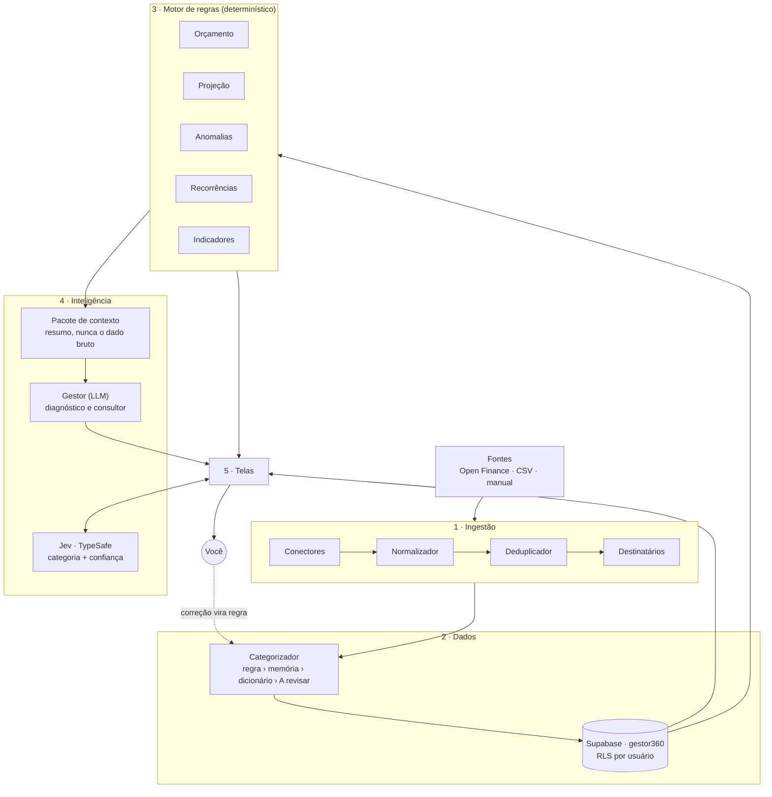

# Gestor Financeiro 360

[](https://github.com/mayconnas/dinheiro360/actions/workflows/ci.yml)

Gestão financeira pessoal como se você tivesse contratado um gestor: o app importa seus lançamentos do banco (Open Finance), organiza, calcula onde o dinheiro está indo e um consultor de IA diagnostica e aconselha com base nos **seus** números.

O princípio que sustenta a arquitetura: **separar o que calcula do que aconselha**. Saldo, orçamento, projeção e indicadores saem de código determinístico e testado. A IA nunca faz conta — ela recebe os números prontos e decide o que fazer com eles.

---

## O que o app faz

- **Importa lançamentos** do banco via Open Finance (Pluggy, com webhook e sincronização agendada), de extratos CSV ou manualmente — normalizados, sem duplicatas entre fontes.
- **Categoriza sozinho** por regras, memória do histórico e dicionário de estabelecimentos; aprende com cada correção sua.
- **Categoriza com IA de decisão** ([TypeSafe Jev](https://docs.typesafe.ai)): cada lançamento pendente recebe a categoria mais provável entre as suas, com o grau de confiança. Você revisa antes de aplicar.
- **Calcula** orçamento por categoria, projeção do mês, anomalias, recorrências (assinaturas e contas fixas) e indicadores de saúde financeira.
- **Aconselha**: o Gestor (Claude, GPT, Gemini ou DeepSeek — você escolhe e usa a sua chave) faz diagnóstico e responde perguntas com base no Pacote de Contexto.

---

## Arquitetura



A fronteira entre números (camada 3) e linguagem (camada 4) é o **Pacote de Contexto**: um resumo estruturado, não o extrato. Detalhes módulo a módulo e regras de negócio em [`arquitetura-gestor-financeiro.md`](./arquitetura-gestor-financeiro.md).

---

## Decisões de engenharia

| Decisão | Por quê |
|---|---|
| **Motor de regras em funções puras** (`src/lib/engine`) | Toda conta crítica é testável isoladamente, sem banco nem rede. A IA só interpreta o resultado. |
| **Pacote de Contexto como contrato com a IA** | O LLM recebe números já calculados e cita a base de cada afirmação — elimina a alucinação numérica. Trocar de provedor não mexe nas camadas abaixo. |
| **Banco tipado** (`database.types.ts` + `DbClient`) | Toda query é checada contra o esquema. Ao ligar a tipagem, ela pegou status nulo chegando à UI e valores gravados sem respeitar os CHECKs do banco. |
| **Validação com zod na fronteira das Server Actions** | Server Actions são endpoints HTTP públicos: o TypeScript não protege o payload. Toda escrita passa por um schema (`src/lib/validation`). |
| **RLS + filtro explícito por `user_id` + guarda de posse** | Três camadas: a RLS isola linhas; o filtro mantém o isolamento se um cliente admin for usado; o guard (`src/lib/data/guards.ts`) impede gravar referência para a categoria de outro usuário — algo que a chave estrangeira aceitaria. |
| **Chaves de API cifradas em repouso** (AES-256-GCM, `secret-box.ts`) | O AAD amarra o texto cifrado a `usuário:provedor` — copiar a coluna para outra linha não vaza a chave. Um único repositório (`credential-store.ts`) toca na coluna, e chaves legadas em texto puro são recifradas na primeira leitura. |
| **Jev: uma requisição por lançamento** | O modelo perde precisão com estado cheio de detalhe irrelevante. Cada pergunta é um *Choice* com as categorias do usuário como opções, exemplos do histórico e opção "nenhuma". A confiança decide o que vem pré-marcado. |
| **Regras aprendidas com salvaguardas** | Uma regra casa por substring em todos os lançamentos futuros. Só vira regra a escolha de alta confiança ou corrigida pelo usuário, sem conflito no lote nem no histórico, e nunca uma descrição genérica de extrato ("PIX RECEBIDO"). |
| **Leituras paginadas** | O PostgREST corta respostas acima de `max-rows` sem erro. Listagens, totais de patrimônio e contagens paginam; a listagem não carrega o JSON bruto da Pluggy. |
| **Migrations versionadas** (`scripts/migrate.sh`) | Cada arquivo é aplicado uma vez, em transação, com checksum registrado — detecta migration alterada depois de aplicada. |
| **Liveness separada de readiness** (`/api/health`) | O container reinicia só se o processo travar; uma queda do banco não faz o orquestrador reciclar o app em loop. |
| **Logs estruturados** (`src/lib/observability/logger.ts`) | JSON com módulo, contexto e erro serializado; chaves, tokens e senhas são redigidos automaticamente. |

---

## Stack

**Next.js 15** (App Router, Server Actions) · **React 19** · **TypeScript** estrito · **Tailwind** + Radix/shadcn · **Supabase** (Postgres, Auth, RLS) · **zod** · **Vitest** · **Docker Swarm** + Traefik · **GitHub Actions** (CI, build da imagem no GHCR, deploy por SSH).

Integrações: **Pluggy** (Open Finance), **Anthropic / OpenAI / Google / DeepSeek** (Gestor), **TypeSafe Jev** (categorização).

---

## Estrutura

```
src/
├── app/                  rotas (App Router), Server Actions e API (webhook, cron, health)
├── components/           UI por tela (painel, transações, configurações…)
└── lib/
    ├── engine/           camadas 1–3: normalizador, dedup, categorizador, motor de regras (puro)
    ├── data/             repositório, mapeadores linha→domínio, guardas de posse
    ├── ai/               camada 4: Gestor (LLM), Jev (TypeSafe), credenciais
    ├── pluggy/           cliente e sincronização Open Finance
    ├── supabase/         clientes tipados + tipos do banco
    ├── validation/       schemas zod das Server Actions
    ├── security/         cifragem de segredos
    ├── auth/             sessão nas Server Actions
    └── observability/    logger estruturado
supabase/migrations/      esquema versionado (0001 → 0011)
scripts/migrate.sh        aplica migrations pendentes
docs/OPERACAO.md          deploy, migrations, monitoramento, rollback
```

---

## Rodando localmente

**Pré-requisitos:** Node.js 22+, um projeto Supabase (o gratuito basta) e `psql` para as migrations.

```bash
npm install
cp .env.local.example .env.local      # preencha os valores (tabela abaixo)
DATABASE_URL="postgres://..." scripts/migrate.sh up   # cria o schema gestor360
npm run dev                           # http://localhost:3000
```

Crie a conta na tela de cadastro: o perfil, as contas e as categorias padrão são criados no primeiro acesso.

### Variáveis de ambiente

| Variável | Obrigatória | Descrição |
|---|---|---|
| `NEXT_PUBLIC_SUPABASE_URL` / `NEXT_PUBLIC_SUPABASE_ANON_KEY` | Sim | Projeto Supabase |
| `SUPABASE_SERVICE_ROLE_KEY` | Sim | Webhook e cron da Pluggy (sem sessão) e health check |
| `AI_CREDENTIALS_ENCRYPTION_KEY` | Sim | Cifra as chaves de API dos usuários. `openssl rand -base64 32`. **Use o mesmo valor em todos os ambientes que compartilham o banco.** |
| `PLUGGY_CLIENT_ID` / `PLUGGY_CLIENT_SECRET` | Para Open Finance | Credenciais da Pluggy |
| `PLUGGY_WEBHOOK_URL` / `PLUGGY_WEBHOOK_SECRET` | Para Open Finance | Webhook público (HTTPS) |
| `CRON_SECRET` | Para Open Finance | Protege as rotas de sincronização agendada |
| `ANTHROPIC_API_KEY` / `ANTHROPIC_MODEL` | Não | Chave padrão do Gestor quando o usuário não cadastrou a própria |
| `TYPESAFE_API_KEY` / `TYPESAFE_MODEL` | Não | Chave padrão do Jev (padrão do modelo: `jev-latest`) |
| `LOG_LEVEL` | Não | `debug` · `info` (padrão em produção) · `warn` · `error` |

---

## Qualidade

| Script | O que faz |
|---|---|
| `npm test` | Suíte Vitest (motor de regras, categorização, Jev, validação, cifragem) |
| `npm run test:coverage` | Cobertura do `src/lib` |
| `npm run typecheck` | `tsc --noEmit` em modo estrito |
| `npm run lint` | ESLint (regras do Next.js) |
| `npm run build` | Build de produção |

O CI roda typecheck, lint, testes, build e o build da imagem Docker a cada push. Deploy, migrations, monitoramento e rollback estão em [`docs/OPERACAO.md`](./docs/OPERACAO.md).
