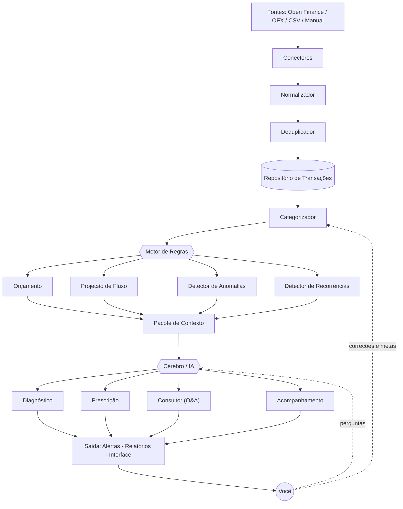

# Arquitetura — Gestor Financeiro 360

> Escopo de arquitetura. Sem interface: define camadas, módulos, responsabilidades e regras.

**Visão.** Uma gestão financeira 360 como se você tivesse contratado um gestor pessoal para cuidar do seu dinheiro — alguém que não só mostra o que está acontecendo, mas diagnostica, aconselha, projeta e cobra. Todo o resto existe para servir a essa promessa: a camada 4 (o cérebro) é o gestor; as camadas 1–3 são os olhos e a calculadora que o alimentam.

---

## 1. Princípio da arquitetura

**Separar o que _calcula_ do que _aconselha_.**

Toda conta crítica — saldo, orçamento, projeção — é determinística: código puro, sem IA, sem margem para erro. O "gestor" (a IA) **não faz conta**: ele lê os números já calculados e decide o que fazer com eles, em linguagem natural. Assim se ganha o melhor dos dois lados — números confiáveis **e** conselho inteligente — sem o risco de a IA inventar um valor.

O sistema é uma esteira de 5 camadas. O dado entra, é limpo e guardado, passa pelas regras, é interpretado pelo cérebro e sai como ação.

```
┌───────────────────────────────────┐
│  5. Saída        (alertas, UI)     │   ← o que você vê e recebe
├───────────────────────────────────┤
│  4. Cérebro / IA (o gestor)        │   ← interpreta e aconselha
├───────────────────────────────────┤
│  3. Motor de Regras (contas)       │   ← calcula, projeta, sinaliza
├───────────────────────────────────┤
│  2. Núcleo de Dados                │   ← guarda e categoriza (verdade)
├───────────────────────────────────┤
│  1. Ingestão                       │   ← puxa o dado de qualquer fonte
└───────────────────────────────────┘
        ⇅  Perfil · Configuração · Segurança  (transversais a todas)
```

Regra de ouro do fluxo: **a informação só sobe.** Cada camada só conhece a de baixo. Trocar a fonte de dados (manual → OFX → Open Finance) não mexe em nada acima da camada 1. Trocar o modelo de IA não mexe em nada abaixo da camada 4.

---

## 2. Organograma dos módulos

```
GESTOR FINANCEIRO 360
│
├── 1. INGESTÃO
│   ├── 1.1 Conectores          (Open Finance · OFX · CSV · Manual)
│   ├── 1.2 Normalizador        (padroniza formato, sinal, data, moeda)
│   └── 1.3 Deduplicador        (remove lançamento repetido entre fontes)
│
├── 2. NÚCLEO DE DADOS
│   ├── 2.1 Repositório         (fonte da verdade — todas as transações)
│   ├── 2.2 Categorizador       (classifica cada lançamento; aprende)
│   ├── 2.3 Contas & Saldos     (saldos, patrimônio líquido)
│   └── 2.4 Perfil & Config     (renda, categorias, tetos, metas)
│
├── 3. MOTOR DE REGRAS  (determinístico)
│   ├── 3.1 Orçamento           (teto por categoria + status)
│   ├── 3.2 Projeção de Fluxo   (previsão de fechamento do mês)
│   ├── 3.3 Detector de Anomalias (gasto fora do padrão, cobrança nova)
│   ├── 3.4 Detector de Recorrências (assinaturas e contas fixas)
│   └── 3.5 Indicadores de Saúde  (placar: poupança, reserva, dívida…)
│
├── 4. CÉREBRO / IA  (o gestor)
│   ├── 4.1 Diagnóstico         (qual é o problema, o que mudou)
│   ├── 4.2 Prescrição          (ações ranqueadas por impacto)
│   ├── 4.3 Consultor (Q&A)     ("posso parcelar isso?")
│   └── 4.4 Acompanhamento      (cobra o plano, ajusta metas)
│
└── 5. SAÍDA
    ├── 5.1 Alertas             (notificações dos flags e do orçamento)
    ├── 5.2 Relatórios          (resumo do mês, evolução, patrimônio)
    └── 5.3 Interface           (onde tudo aparece — camada visual)

    TRANSVERSAIS: Persistência · Segurança/LGPD · Consentimento Open Finance
```

---

## 3. Fluxo de dados



O ponto-chave: o **Pacote de Contexto** é a fronteira entre o mundo dos números (camada 3) e o mundo da linguagem (camada 4). É um resumo estruturado — nunca o dado bruto — que o cérebro recebe pronto para interpretar.

---

## 4. Módulo a módulo

### Camada 1 — Ingestão

**1.1 Conectores**
Um adaptador por fonte. Cada um sabe conversar com sua origem e cospe transações no formato canônico do sistema.
- Entradas: extrato do Open Finance (via agregador), arquivo OFX/CSV, ou formulário manual.
- Saídas: lista de transações no formato canônico `{ id, data, valor, descrição_bruta, tipo, conta, origem }`.
- Regras: nenhum dado bruto passa daqui para cima; se a fonte não fornece um campo, o conector preenche com o padrão definido. A origem (`open_finance` | `import` | `manual`) fica gravada em toda transação — é ela que resolve conflito depois.

**1.1.a — Conector Open Finance via Meu Pluggy (caminho pessoal, gratuito)**

Para uso pessoal, o Open Finance sai de graça pelo **Meu Pluggy**: você conecta seus bancos uma vez em `meu.pluggy.ai` e liga essa conta à sua aplicação (credenciais `CLIENT_ID`/`CLIENT_SECRET` do dashboard). O custo de agregador (a partir de ~R$2.500/mês no plano pago) só aparece se isto virar produto para outros CPFs.

- **Modelo de conexão:** cada banco vira um *Item* (uma conexão, com `itemId`). O consentimento vive no Item; revogar = deletar o Item.
- **Ciclo de puxar o dado:** (1) autentica no servidor com `CLIENT_ID` + `CLIENT_SECRET` → recebe uma API Key (validade ~2h, acesso total); (2) chama `/accounts` e `/transactions` por Item — traz até 12 meses na primeira carga, incremental depois; (3) converte pro formato canônico e entrega pro Normalizador (1.2).
- **Sincronização:** *event-driven* (webhook `transactions/created` → pagina `/transactions`) ou *polling* (chama a API de tempos em tempos).
- **A decisão do caminho pessoal:** o `CLIENT_SECRET` não pode ficar num app só-navegador, e webhook exige URL HTTPS pública (localhost não vale). Então o conector precisa de uma peça server-side. Duas opções:
  - **Opção 1 — mini-backend:** função serverless (Vercel/Cloudflare) ou script agendado que guarda o segredo e puxa as transações. Habilita auto-sync. É o alvo final.
  - **Opção 2 — exportar/importar:** usa a exportação do Meu Pluggy para planilha e joga no conector de importação (OFX/CSV). Sem servidor, semi-manual. É o começo mais rápido.
  - **Portabilidade:** as duas entregam no mesmo formato canônico, então trocar Opção 2 → Opção 1 depois não mexe em nenhuma camada acima.

**1.2 Normalizador**
Limpa e padroniza o que os conectores trouxeram.
- Regras: valor sempre positivo + campo `tipo` (`entrada`/`saída`) separado; data em ISO (`AAAA-MM-DD`); descrição limpa (remove ruído tipo `COMPRA CARTAO 4412` → `Padaria X`); moeda única (BRL).

**1.3 Deduplicador**
O mesmo gasto pode chegar por duas fontes (você lançou manual e o Open Finance trouxe depois).
- Regra de duplicata: mesma data (± janela de N dias) **e** mesmo valor **e** descrição similar (comparação difusa) → marca como duplicata.
- Regra de prioridade: fonte automática (Open Finance) vence a manual; o lançamento manual é descartado ou fundido, nunca duplicado no saldo.

---

### Camada 2 — Núcleo de Dados

**2.1 Repositório de Transações**
A fonte única da verdade. Todo o resto lê daqui; ninguém calcula em cima de dado bruto de fonte.

**2.2 Categorizador**
Classifica cada lançamento e **aprende** com você.
- Regras, em ordem de precedência:
  1. Regra manual do usuário (`descrição contém "IFOOD" → Comida fora`) — sempre vence.
  2. Memória (essa descrição já foi categorizada como X antes).
  3. Dicionário de estabelecimentos padrão (mapa embutido).
  4. Fallback: `A revisar`.
- Aprendizado: quando você corrige uma categoria, o sistema cria/atualiza uma regra automática — da próxima vez, acerta sozinho.

**2.3 Contas & Saldos**
Mantém as contas, calcula saldo por conta e patrimônio líquido (contas + investimentos − dívidas).

**2.4 Perfil & Configuração**
O que o sistema sabe sobre você: renda, contas conectadas, categorias personalizadas, tetos de orçamento, metas e preferências de alerta. Alimenta as camadas 3 e 4.

---

### Camada 3 — Motor de Regras (determinístico)

Aqui mora a matemática. Zero IA. Cada módulo é uma função previsível e testável.

**3.1 Orçamento**
- Entradas: gastos por categoria do mês + tetos (definidos por você ou sugeridos pela média dos últimos 3 meses).
- Saídas: status por categoria (`gasto`, `teto`, `% consumido`, `restante`).
- Regras: alerta em **80%** do teto; estouro em **100%**; categoria sem teto entra como "sem controle".

**3.2 Projeção de Fluxo**
- Fórmula base: `projeção_fim_do_mês = saldo_atual + receitas_previstas_restantes − (gasto_médio_diário × dias_restantes)`.
- "Disponível para gastar hoje": `(teto_total − já_gasto) ÷ dias_restantes`.
- Saída: valor projetado de fechamento + sinal (azul/vermelho) + quanto ainda dá para gastar sem furar.

**3.3 Detector de Anomalias**
- Regras (cada uma vira um flag):
  - Gasto numa categoria **> X%** acima da média histórica dela.
  - Transação de valor **> média + N desvios-padrão** do seu padrão.
  - Cobrança recorrente **nova** (estabelecimento inédito com cara de assinatura).
  - Assinatura **esperada e ausente** (recorrência que sumiu — pode ser cobrança dobrada em outro lugar).

**3.4 Detector de Recorrências**
- Regra: mesmo estabelecimento + valor aproximado + intervalo ~mensal (± dias) → marca como recorrência (assinatura/conta fixa).
- Usos: alimenta a projeção (custos fixos futuros) e a lista de "assinaturas que você talvez tenha esquecido".

**3.5 Indicadores de Saúde Financeira**
Além dos cálculos operacionais, o motor mantém um *placar* — os indicadores que um gestor de verdade acompanha. São objetivos, determinísticos, e viram a base do modelo de decisão da IA. Cada um tem faixa (bom · atenção · crítico) e tendência.
- **Taxa de poupança** = (receitas − despesas) ÷ receitas. Bom ≥20% · atenção 10–20% · crítico <10% ou negativa. *É a métrica que constrói os 100k.*
- **Reserva de emergência** = saldo líquido ÷ despesa mensal média (em meses). Bom ≥6 · atenção 3–6 · crítico <3.
- **Comprometimento de renda** = (parcelas + dívidas fixas) ÷ receita. Bom <30% · atenção 30–50% · crítico >50%.
- **Peso dos custos fixos** = despesas fixas ÷ receita. Quanto menor, mais folga pra reagir (referência: <50%).
- **Gasto discricionário** = (lazer + comida fora + assinaturas) ÷ receita. É o que dá pra cortar rápido.
- **Tendência de fluxo** = direção da sobra nos últimos 3 meses (subindo · estável · caindo).
- **Evolução do patrimônio líquido** = variação do patrimônio mês a mês. A métrica de longo prazo.
- Saída: um placar `[{ indicador, valor, status, tendência }]` que vai inteiro pro Pacote de Contexto.

---

### Camada 4 — Cérebro / IA (o gestor)

Consome o **Pacote de Contexto** (resumo estruturado das camadas 2 e 3) e produz gestão em linguagem natural. Roda via chamada a um modelo.

- **4.1 Diagnóstico** — lê o resumo + os flags e diz qual é o problema principal, o que mudou vs. meses anteriores e o que está saudável.
- **4.2 Prescrição** — gera ações ranqueadas por impacto (R$/mês liberado), a partir dos vazamentos e recorrências.
- **4.3 Consultor (Q&A)** — você pergunta, ele responde com os seus números ("posso parcelar um notebook de R$4k?").
- **4.4 Acompanhamento** — compara o plano do mês passado com o realizado, cobra e reajusta metas.

**Regras de projeto do cérebro (guardrails):**
- Ele **nunca** faz conta crítica — recebe os números prontos do motor de regras. Isso elimina alucinação numérica.
- Entrada = Pacote de Contexto (resumo do mês, top categorias, flags, orçamento, projeção, metas, histórico resumido). **Nunca** o extrato bruto inteiro.
- Saída = texto **+** (opcional) ações estruturadas em JSON, que a camada de saída transforma em botões ("aplicar teto de R$150", "cancelar assinatura X").
- Toda afirmação numérica cita a base ("com base no seu gasto de R$680…"); se o número não veio no pacote, ele não usa.

---

### O Pacote de Contexto e o modelo de decisão

Estas duas peças são o que torna o sistema *mais completo* que um painel de insights: dados e indicadores bons de um lado, um modelo de decisão do outro.

**O Pacote de Contexto (o contrato com a IA).**
O resumo estruturado que a camada 3 entrega pra camada 4 — nunca o dado bruto. É o que o gestor "lê" antes de decidir. Estrutura:
- `perfil`: renda média, tipo (CLT / autônomo / misto), dependentes.
- `mes_atual`: receitas, despesas, sobra, dias restantes.
- `indicadores`: o placar do 3.5 (cada um com valor, status e tendência).
- `top_categorias`: maiores gastos, % do total e comparação com a média.
- `flags`: anomalias, cobranças novas, orçamentos estourados, recorrências.
- `metas`: alvo, atual, prazo e se está no ritmo.
- `historico`: últimos N meses dos indicadores-chave (pra IA enxergar tendência).

Regra: só número já calculado, formato compacto (JSON), zero extrato bruto.

**O modelo de decisão (a metodologia do gestor).**
A IA não decide no chute — ela raciocina dentro de uma *escada de prioridades financeiras*, como um consultor que segue um método. A escada padrão:
1. **Sair do vermelho** — se a sobra é negativa, a prioridade é cortar discricionário até o fluxo virar positivo. Nada mais importa antes disso.
2. **Construir reserva** — reserva abaixo de 3 meses? Acumular até 3–6 meses antes de qualquer investimento.
3. **Matar dívida cara** — comprometimento alto ou dívida com juros altos vem antes de investir.
4. **Otimizar e investir** — com o básico resolvido, foco em subir a taxa de poupança e alocar (rumo aos 100k).

Como a IA aplica: lê o placar → identifica em que degrau você está (o indicador mais crítico manda) → gera prescrições ranqueadas pelo impacto *naquele degrau*, não uma lista genérica → justifica ancorado no indicador ("sua reserva está em 1,2 mês; antes de investir, vamos levar pra 3"). É isso que faz parecer alguém que você contratou: um método e uma ordem de prioridades, não insights soltos.

A escada é **configurável** — dá pra trocar pela sua filosofia financeira. É o equivalente ao "método próprio" que diferencia produtos como o Meu Planner, só que aqui rodando sobre dados automáticos do Open Finance.

---

### Camada 5 — Saída

**5.1 Alertas** — empurra os flags e o status de orçamento (80%, estouro, cobrança nova). Regra: fila com prioridade e limite de frequência, para não virar spam.
**5.2 Relatórios** — resumo do mês, evolução ao longo do tempo, patrimônio.
**5.3 Interface** — onde tudo isso aparece. É a camada visual (fica para depois, por decisão sua).

---

### Transversais

- **Persistência** — onde os dados moram. Uso pessoal: local no dispositivo. Produto: banco relacional (ex.: Postgres) com um registro por transação.
- **Segurança / LGPD** — dado financeiro é sensível. Pessoal: tudo local, nada sai. Produto: criptografia em repouso e trânsito + gestão de consentimento.
- **Consentimento Open Finance** — a conexão regulada fica a cargo do agregador (Meu Pluggy no caminho pessoal), não do seu app. Dois pontos que o conector precisa tratar: o consentimento é autorizado por um período e depois **precisa ser renovado** — o sistema deve lembrar de renovar antes de vencer, senão o feed seca; e revogar acesso é deletar o Item correspondente.

---

## 5. Regras de negócio (consolidado)

Um índice das regras espalhadas acima, para consulta rápida:

| # | Regra | Onde |
|---|-------|------|
| R1 | Origem gravada em toda transação; automática vence manual | 1.1 / 1.3 |
| R2 | Valor positivo + campo `tipo` separado; data ISO | 1.2 |
| R3 | Duplicata = data±janela + valor + descrição similar | 1.3 |
| R4 | Categoria por precedência: regra do usuário → memória → dicionário → "a revisar" | 2.2 |
| R5 | Correção do usuário vira regra automática (aprendizado) | 2.2 |
| R6 | Orçamento: alerta 80%, estouro 100% | 3.1 |
| R7 | Teto sugerido = média dos últimos 3 meses | 3.1 |
| R8 | Projeção = saldo + receitas restantes − (gasto médio diário × dias restantes) | 3.2 |
| R9 | Anomalia = gasto acima da média por categoria, ou valor > média + N desvios | 3.3 |
| R10 | Recorrência = mesmo estabelecimento + valor ~igual + intervalo ~mensal | 3.4 |
| R11 | Cérebro nunca calcula; só interpreta números já prontos | 4 |
| R12 | Cérebro nunca cita número fora do Pacote de Contexto | 4 |
| R13 | Alertas com prioridade e teto de frequência | 5.1 |
| R14 | Open Finance pessoal via Meu Pluggy (grátis); credenciais só no servidor | 1.1.a |
| R15 | Consentimento tem prazo: renovar antes de vencer; revogar = deletar o Item | 1.1.a / Transversais |
| R16 | Indicadores de saúde com faixas (bom/atenção/crítico) definem o status | 3.5 |
| R17 | IA decide dentro da escada de prioridades; o indicador mais crítico manda | 4 / Modelo de decisão |

---

## 6. Decisões técnicas

- **Determinístico vs. IA:** tudo que é número (camadas 1–3) é código. Tudo que é julgamento e linguagem (camada 4) é IA. A fronteira entre os dois é o Pacote de Contexto.
- **Open Finance:** só entra pela camada 1, via agregador licenciado pelo Banco Central. Para uso pessoal, o **Meu Pluggy resolve de graça** (ver 1.1.a) — o custo de ~R$2.500/mês só volta se virar produto para múltiplos CPFs. Enquanto isso não acontece, dá para começar pela Opção 2 (exportar/importar) sem nenhuma infraestrutura.
- **Cérebro via MCP (bônus):** a Pluggy publica um servidor MCP que expõe a API dela como ferramentas para clientes como Claude e Cursor. Lá na frente, isso permite ligar a camada 4 (o gestor) direto nos dados via MCP, encurtando o meio de campo.
- **Persistência:** local para pessoal, banco para produto. A decisão não afeta as regras — só o módulo de persistência.
- **Privacidade:** decidir cedo, porque muda a arquitetura de dados (local isolado vs. servidor com criptografia e consentimento).

---

## 7. Roadmap de construção

| Fase | Entrega | Módulos |
|------|---------|---------|
| **1 — Base** | Registrar e ver (já temos o protótipo) | 1.3 (manual) · 2.1 · 2.2 (simples) · 5.2 |
| **2 — Contas** | O sistema calcula e projeta | 3.1 · 3.2 · 3.3 · 3.4 |
| **3 — Gestor** | A IA diagnostica e responde | 4.1 · 4.2 · 4.3 · Pacote de Contexto |
| **4 — Autonomia** | Puxa sozinho e cobra o plano | 1.1.a Opção 2 → Opção 1 (Meu Pluggy) · 4.4 · 5.1 |

**Sobre a ingestão (conector 1.1):** o caminho é incremental e gratuito para uso pessoal. Começa manual (Fase 1); ganha a exportação/importação do Meu Pluggy (Opção 2) assim que você quiser menos digitação; e vira automático de verdade com o mini-backend (Opção 1) na Fase 4. O custo de agregador só entra se o projeto virar produto.

A ordem importa: o cérebro (Fase 3) só é bom se o motor de regras (Fase 2) já estiver alimentando ele com números confiáveis. Construir a IA antes das contas é construir um gestor que chuta.
