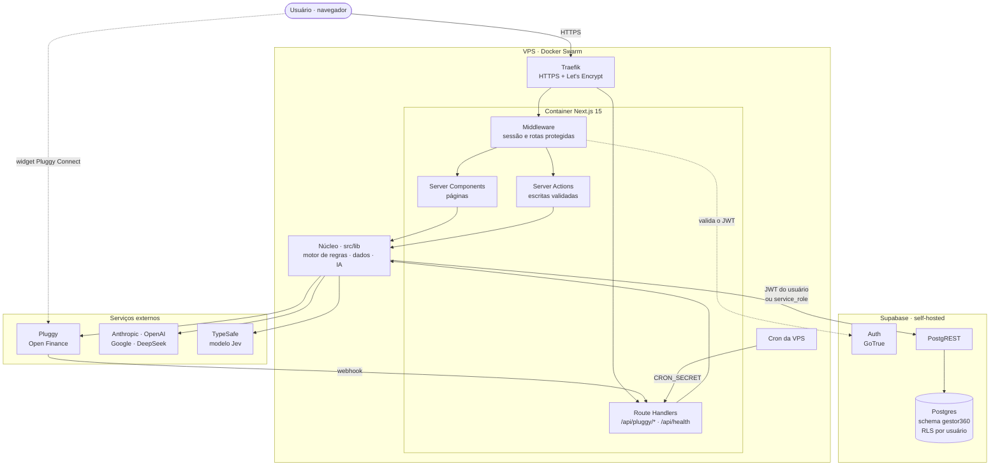
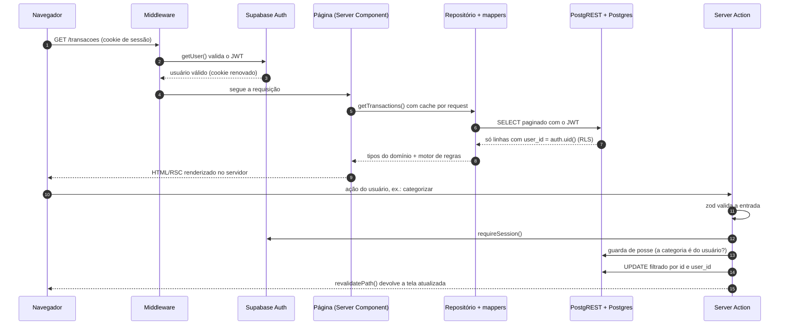
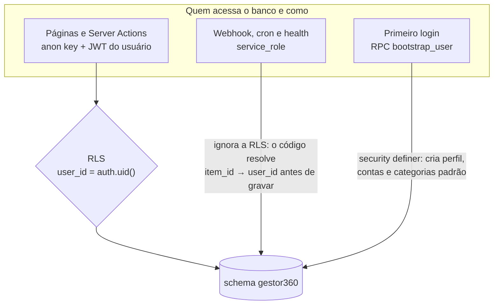
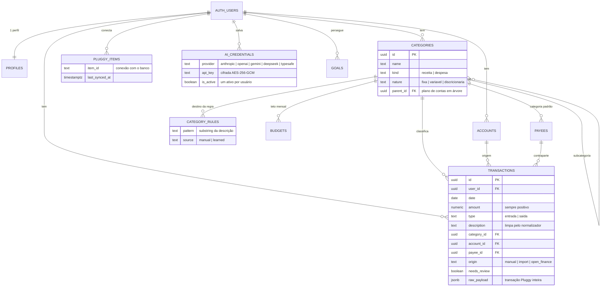
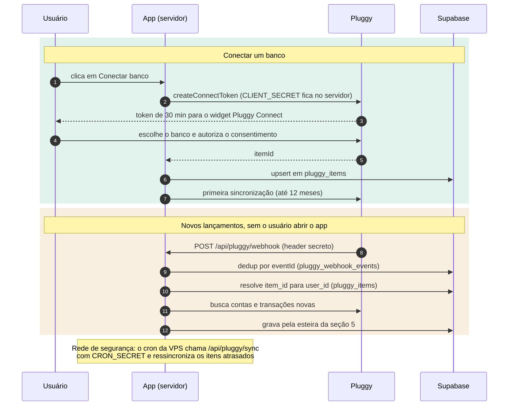
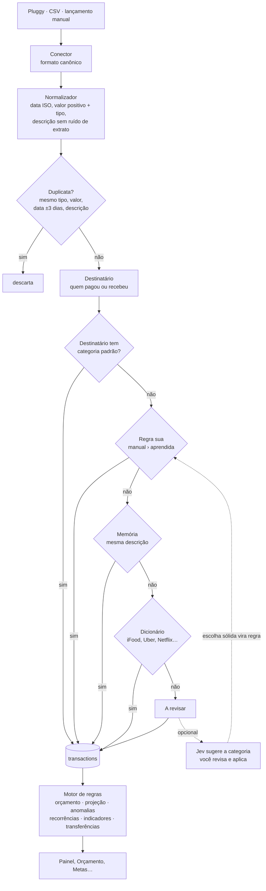
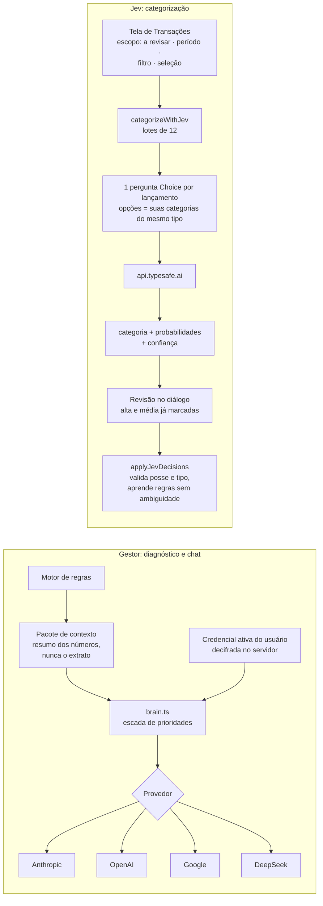
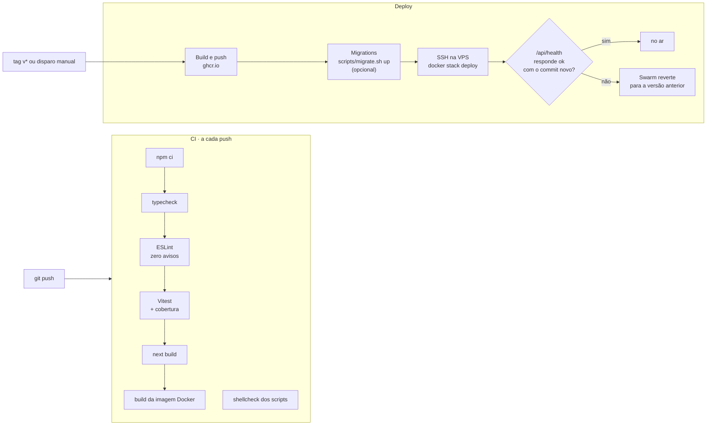

# Mapa da arquitetura

Como o Gestor Financeiro 360 funciona de ponta a ponta: quem fala com quem, como o Supabase é usado, por onde entram os lançamentos do banco, onde a IA participa e como o código chega à produção. Os diagramas são Mermaid e refletem o código deste repositório.

- [1. Visão geral](#1-visão-geral)
- [2. Ciclo de uma requisição](#2-ciclo-de-uma-requisição)
- [3. Supabase por dentro](#3-supabase-por-dentro)
- [4. Open Finance (Pluggy)](#4-open-finance-pluggy)
- [5. A esteira de um lançamento](#5-a-esteira-de-um-lançamento)
- [6. Inteligência artificial](#6-inteligência-artificial)
- [7. CI/CD e deploy](#7-cicd-e-deploy)
- [8. Stacks](#8-stacks)

---

## 1. Visão geral

O app é um único container Next.js. O navegador nunca fala com o banco diretamente: páginas e ações rodam no servidor, que consulta o Supabase com o token do usuário logado. A RLS do Postgres garante que cada pessoa só enxergue as próprias linhas. Só os endpoints chamados por máquinas (webhook e cron da Pluggy, health check) usam a chave `service_role`.

---

## 2. Ciclo de uma requisição

Toda escrita passa pela mesma sequência: validar a entrada (Server Actions são endpoints HTTP públicos), confirmar a sessão, conferir a posse do que é referenciado e só então gravar. Depois, `revalidatePath` faz o Next renderizar a página de novo com os dados atualizados, sem estado duplicado no navegador.

---

## 3. Supabase por dentro

### Três formas de acesso

| Acesso | Chave | Onde | Isolamento |
|---|---|---|---|
| Usuário logado | anon + JWT da sessão | Server Components, Server Actions | RLS + filtro explícito por `user_id` + guardas de posse |
| Sistema | `service_role` | `/api/pluggy/webhook`, `/api/pluggy/sync`, `/api/pluggy/reprocess`, `/api/health` | O código resolve o dono pelo `pluggy_items` e filtra por `user_id` |
| Bootstrap | função `security definer` | layout autenticado, no 1º acesso | A função usa `auth.uid()` e é idempotente |

Os clientes são tipados com o esquema real (`src/lib/supabase/database.types.ts`), então toda query é checada pelo TypeScript. As chaves de API que os usuários salvam ficam cifradas com AES-256-GCM antes de chegar ao banco (`src/lib/security/secret-box.ts`).

### Modelo de dados

As migrations ficam em `supabase/migrations` e são aplicadas por `scripts/migrate.sh`, que registra cada arquivo com checksum em `gestor360.schema_migrations`.

---

## 4. Open Finance (Pluggy)

---

## 5. A esteira de um lançamento

Regras e memória só valem para categorias do mesmo tipo do lançamento: receita para entrada, despesa para saída. Tudo até o banco é código determinístico e testado (`src/lib/engine`, 99% de cobertura).

---

## 6. Inteligência artificial

A IA nunca faz conta. O Gestor recebe números já calculados e cita a base de cada afirmação. O Jev recebe um lançamento por vez, só com os campos úteis, e nada é gravado antes de você aplicar.

---

## 7. CI/CD e deploy

O container tem duas sondas: `/api/health?probe=live` (o processo responde, usada pelo Swarm) e `/api/health` (inclui o banco, usada pelo deploy e por monitores externos). Assim, uma queda do Supabase não faz o orquestrador reiniciar o app em loop. Passo a passo de operação em [`OPERACAO.md`](./OPERACAO.md).

---

## 8. Stacks

| Camada | Tecnologia | Versão | Papel |
|---|---|---|---|
| Framework | Next.js (App Router, Server Actions) | 15.5 | Páginas renderizadas no servidor, ações e API num só deploy |
| UI | React | 19 | Interface |
| | Tailwind CSS + Radix UI (shadcn/ui) + lucide-react | 3.4 | Estilo, componentes acessíveis e ícones |
| | Recharts + Chart.js | 2.15 / 4.5 | Gráficos do painel |
| Linguagem | TypeScript (modo estrito) | 5.9 | Tipos de ponta a ponta, inclusive do banco |
| Validação | zod | 3.25 | Entrada de todas as Server Actions |
| Banco e login | Supabase: Postgres + Auth (GoTrue) + PostgREST | self-hosted | Dados, sessão e RLS |
| | @supabase/supabase-js + @supabase/ssr | 2.117 / 0.12 | Clientes tipados no servidor e no navegador |
| Open Finance | Pluggy (API + widget react-pluggy-connect) | 2.12 | Contas e transações dos bancos |
| IA | Anthropic SDK, OpenAI, Google Gemini, DeepSeek | — | Gestor: diagnóstico e chat (o usuário escolhe o provedor) |
| | TypeSafe Jev | jev-latest | Categorização com probabilidade e confiança |
| Segurança | AES-256-GCM (node:crypto) | — | Chaves de API cifradas em repouso |
| Qualidade | Vitest + cobertura v8 | 3.2 | 363 testes do motor, IA, validação e cifragem |
| | ESLint (regras do Next) | 9 | Zero avisos no CI |
| Infra | Docker (multi-stage, Node 22 Alpine) + Docker Swarm | — | Imagem enxuta e deploy com rollback |
| | Traefik | — | HTTPS e roteamento na VPS |
| | GitHub Actions + GHCR | — | CI, build e publicação da imagem, deploy por SSH |
| Observabilidade | Logger JSON próprio + `/api/health` | — | Logs estruturados com segredos redigidos e sondas de saúde |
